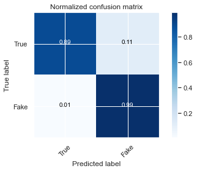

# Project 5: Detecting Fake News
This project was developed by Brian Mendes, Johann Baydeer, and Elliot Richardson. Please see the individual notebooks to follow our processes.

## Table of contents
### I. [Background](#Background)
### II. [Datasets used](#Datasets)
### III. [Processing](#Processing)
### IV. [Feature engineering](#Feature-engineering-experiments)
### V. [Exploratory analysis](#Exploratory-analysis)
### VI. [Modeling](#Modeling)
### VII. [Conclusion](#Conclusion)

## Background

The promise of the internet was to democratize information. News was no longer controlled by institutions. An individual could start a blog and broadcast a message to the world. With this leveling of the playing field came unforeseen consequences. Traditional news sources lost revenue streams, fired journalists and lost control of editorial review. Media became decentralized and moved online. As a result, “news” was driven by clickoncomics rather than journalistic principles. Content providers needed to attract attention vis-à-vis clicks and eyeballs by any means necessary. Terms such as “truthiness”, “infotainment” and “fake news” captured the spirit of this transformation of news in the information age. The dilemma we face in today’s world is distinguishing between facts and deception. We need help curating the content to cut through the noise and obtain reliable information. Due to the sheer volume of content produced each day, computers and machine learning could be tools that help us accomplish this goal. 

## Datasets

The datasets are from Kaggle.com and can be accessed from the following link:
https://www.kaggle.com/clmentbisaillon/fake-and-real-news-dataset

### Original data:
The website has two csv files, Fake.csv and True.csv. The fake news file is 59.99 MB and the true news file is 51.1 MB. Each file has the same 4 columns: title, text, subject, and date.

| Column | Data type | Description |
| --- | --- | --- |
| Title | String / object | The title of the article |
| Text | String / object | The text of the article |
| Subject | String / object | The subject of the article |
| Date | String / object (converted to datetime) | The date at which the article was posted |

Unfortunately, the datasets do not have a data dictionary. Kaggle does not explain how the data was gathered, the news source, or the methodology used to categorize news as “real” or “fake”. While this background information would help deepen our understanding of the dataset and aid in our analysis, it is not necessary in order to perform an NLP analysis. We therefore took the dataset at its face value and accepted that the data was categorized correctly. 

## Data used in final models:

After processing, our final features were made up of five different categories:

1. The first type is a binary classifier indicating whether the article was focused on international or domestic (U.S.) news. This    type accounts for a single column
2. The second type is targeted stats about the news articles, including but not limited to the following: number of words in the      headline and text, number of characters in the headline and text, number of special characters ($, #, ?, !, etc.), and ratios.    These features account for 22 columns. 
3. The third type is sentiment analysis for both the titles and texts of each article. These features make up 8 columns. 
4. The fourth type of features are the part of speech tags which make up 18 columns.
5. The fifth type is the most significant stemmed words from the text. These features make up 577 columns. 

See below for a more detailed breakdown of all the above columns save the fifth type (individual stemmed words).

 | Column | Data type | Description | 
 | --- | --- | --- |
 | domestic | int64 | Whether the news was focused on international or domestic happenings (as determined by the original curator of the dataset) |
 | title_word_count | int64 | Number of words in the article title |
 | text_word_count | int64 | Number of words in the article text |
 | title_uppercase_count | int64 | Number of uppercase letters in the article title |
 | title_lowercase_count | int64 | Number of lowercase letters in the article title |
 | title_all_letter_count | int64 | Number of letters in the article title |
 | title_special_count | int64 | Number of special characters in the article title |
 | title_! | int64 | Number of exclamation points (!) in the article title |
 | title_? | int64 | Number of question marks (?) in the article title |
 | title_# | int64 | Number of hashtags / pound signs (#) in the article title |
 | title_% | int64 | Number of percentage signs (%) in the article title |
 | title_$ | int64 | Number of dollar signs ($) in the article title |
 | title_parentheses | int64 | Number of parents ( “(“ or “)” ) in the article title |
 | text_uppercase_count | int64 | Number of uppercase letters in the article text |
 | text_lowercase_count | int64 | Number of lowercase letters in the article text |
 | text_all_letter_count | int64 | Number of letters in the article text |
 | text_special_count | int64 | Number of special characters in the article text |
 | text_! | int64 | Number of exclamation points (!) in the article text |
 | text_? | int64 | Number of question marks (?) in the article text |
 | text_# | int64 | Number of hashtags / pound signs (#) in the article text |
 | text_% | int64 | Number of percentage signs (%) in the article text |
 | text_$ | int64 | Number of dollar signs ($) in the article text |
 | text_parentheses | int64 | Number of parents ( “(“ or “)” ) in the article text |
 | title_sa_neg | float64 | Negativity score of article title as determined by [vader.Sentiment](https://github.com/cjhutto/vaderSentiment)  SentimentIntensityAnalyzer |
 | title_sa_pos | float64 | Positivity score of article title as determined by [vader.Sentiment](https://github.com/cjhutto/vaderSentiment)  SentimentIntensityAnalyzer |
 | title_sa_neu | float64 | Neutrality score of article title as determined by [vader.Sentiment](https://github.com/cjhutto/vaderSentiment)  SentimentIntensityAnalyzer |
 | title_sa_compound | float64 | Compound sentiment score of article title as determined by [vader.Sentiment](https://github.com/cjhutto/vaderSentiment)  SentimentIntensityAnalyzer |
 | text_sa_neg | float64 | Negativity score of article text as determined by [vader.Sentiment](https://github.com/cjhutto/vaderSentiment)  SentimentIntensityAnalyzer |
 | text_sa_pos | float64 | Positivity score of article text as determined by [vader.Sentiment](https://github.com/cjhutto/vaderSentiment)  SentimentIntensityAnalyzer |
 | text_sa_neu | float64 | Neutrality score of article text as determined by [vader.Sentiment](https://github.com/cjhutto/vaderSentiment)  SentimentIntensityAnalyzer |
 | text_sa_compound | int64 | Compound sentiment score of article text as determined by [vader.Sentiment](https://github.com/cjhutto/vaderSentiment)  SentimentIntensityAnalyzer |
 | ADJ_prop | float64 | Ratio of adjectives in the concatenated article title and text as compared to the number of words overall (calculated using [spaCy](https://spacy.io/)) |
 | ADP_prop | float64 | Ratio of adpositions in the concatenated article title and text as compared to the number of words overall (calculated using [spaCy](https://spacy.io/)) |
 | ADV_prop | float64 | Ratio of adverbs in the concatenated article title and text as compared to the number of words overall (calculated using [spaCy](https://spacy.io/)) |
 | AUX_prop | float64 | Ratio of auxiliary verbs in the concatenated article title and text as compared to the number of words overall (calculated using [spaCy](https://spacy.io/)) |
 | CCONJ_prop | float64 | Ratio of coordinating conjunctions in the concatenated article title and text as compared to the number of words overall (calculated using [spaCy](https://spacy.io/)) |
 | DET_prop | float64 | Ratio of determiners in the concatenated article title and text as compared to the number of words overall (calculated using [spaCy](https://spacy.io/)) |
 | INTJ_prop | float64 | Ratio of interjections in the concatenated article title and text as compared to the number of words overall (calculated using [spaCy](https://spacy.io/)) |
 | NOUN_prop | float64 | Ratio of nouns in the concatenated article title and text as compared to the number of words overall (calculated using [spaCy](https://spacy.io/)) |
 | NUM_prop | float64 | Ratio of numerical digits in the concatenated article title and text as compared to the number of words overall (calculated using [spaCy](https://spacy.io/)) |
 | PART_prop | float64 | Ratio of particles in the concatenated article title and text as compared to the number of words overall (calculated using [spaCy](https://spacy.io/)) |
 | PRON_prop | float64 | Ratio of pronouns in the concatenated article title and text as compared to the number of words overall (calculated using [spaCy](https://spacy.io/)) |
 | PROPN_prop | float64 | Ratio of proper nouns in the concatenated article title and text as compared to the number of words overall (calculated using [spaCy](https://spacy.io/)) |
 | PUNCT_prop | float64 | Ratio of punctuation marks in the concatenated article title and text as compared to the number of words overall (calculated using [spaCy](https://spacy.io/)) |
 | SCONJ_prop | float64 | Ratio of subordinating conjunctions in the concatenated article title and text as compared to the number of words overall (calculated using [spaCy](https://spacy.io/)) |
 | SPACE_prop | float64 | Ratio of spaces in the concatenated article title and text as compared to the number of words overall (calculated using [spaCy](https://spacy.io/)) |
 | SYM_prop | float64 | Ratio of symbols in the concatenated article title and text as compared to the number of words overall (calculated using [spaCy](https://spacy.io/)) |
 | VERB_prop | float64 | Ratio of verbs in the concatenated article title and text as compared to the number of words overall (calculated using [spaCy](https://spacy.io/)) |
 | X_prop | float64 | Ratio of unidentifiable parts of speech in the concatenated article title and text as compared to the number of words overall (calculated using [spaCy](https://spacy.io/)) |
 | is_true | int64 | Binary target variable denoting whether an article is real or fake (1 = real, 0 = fake) |


## Processing

Libraries necessary for this section: 

```
import pandas as pd
import seaborn as sns
import numpy as np
import matplotlib.pyplot as plt
import re 
import spacy

from nltk.tag import pos_tag
from vaderSentiment.vaderSentiment import SentimentIntensityAnalyzer
from nltk.stem import PorterStemmer
from sklearn.feature_extraction.text import CountVectorizer, TfidfVectorizer
```
### a. [Cleaning](./code/I-Cleaning.ipynb)

The datasets comprised two csv files - one for real news and one for fake news. The goal of this notebook was to compile the data into one dataframe and clean it. The text was divided into one column for headlines called 'title' and one column for the article text called 'text'. The 'subject' column categorized the news into generic categorizes, such as politics news and world news. The 'date' column showed the date the article was posted online. 

We performed the following data cleaning steps:
- The fake news data frame included 45 rows with dates saved as odd formats and website urls. Since this only accounted for 0.2% of the fake news dataframe we decided to drop these rows. It did not affect the balance of classes (real news vs. fake news) and we had plenty of data to work with for the rest of the analysis. 
- Created target variable: 1 is real news, 0 is fake news.
- Removed duplicated articles.
- Checked the data types and converted all values in the date column to a date/time format.
- Used regex to extract words and symbols that could get lost in count vectorization and word stemming. For both the title and text, we created new columns that counted the occurrence of uppercase letters, lowercase letters, uppercase and lowercase letters, word count, character count, and special characters (!?#%$())

Next, we did a train/test split. This was necessary due to the large file size which was causing file upload issues.  Splitting the data at this step helped keep the file size down.

Last step was saving the train/test data frames to csv files 

### b. [Sentiment analysis](./code/II-Sentiment-and-POS-Tagging.ipnyb)

In order to generate sentiment scores for the titles and text of each article, we employed vader.Sentiment’s SentimentIntensityAnalyzer. We looped through each row of data, used the SentimentIntensityAnalyzer to generate scores, and inserted those sentiment scores into new columns separated out by text, title, and each sentiment type (positive, negative, neutral, and compound). These scores were used as features in the final classification model.

### c. [Part of speech tagging](./code/II-Sentiment-and-POS-Tagging.ipnyb)

We used the part of speech tagging extraction features to analyze and compare the syntax of real news and fake news articles.  The sentences of all articles were split by words and assigned a tag corresponding to their grammatical category. Then, a ratio was calculated based on the frequency or reoccurrence of those tags in each sentence. Columns were created for each part of speech tags and their ratios.  When we compared the scores of each POS tag for the real news and fake news articles, the differences were not substantial. Fake news articles used more adverbs, more interjection and more symbols but overall the scores were pretty closed. The part of speech analysis didn’t highlight any major differences but these features can still be useful for the models.

### d. [Words as features](./code/III-Selecting-Words-as-Features.ipnyb)

In order to find the most important words used in these articles, we started by concatenating the titles with their corresponding text, vectorizing these combined texts with sklearn’s CountVectorizer, and creating new strings where all of the words had been replaced with their stems (as created by nltk’s PorterStemmer). We then utilized the CountVectorizer again to create a dataframe that contained the frequency of use for each stem. In order to narrow this extremely large dataframe down to the most significant words, we utilized sklearn’s TfidfVectorizer, which we used to create a dataframe with “importance” scores for each stem. We narrowed the stems to only those who had an importance score above 0.01 for either real or fake news and narrowed our stem frequency dataframe down to those 577 words.

## Feature engineering experiments

### a. [Time series](./code/IVa-Time-Series-Experiment.ipynb)

The idea behind this analysis was to determine if we could forecast fake news. The dataset has news articles organized by the date of publication and the target would be the mean of news articles per day. Real news was assigned a value of 1 and fake news a value of 0. After preprocessing the data, grouping it into a daily index, and plotting a time series, it became clear that we were operating under flawed logic. The time series line did not show an objective measurement, such as the closing price of a stock, but rather showed the number of news articles gathered each day. All trends in the data could be explained by data scraping. Since Kaggle did not provide a data dictionary, we do not know how the data was collected. The first 6 months of the data set shows only fake news. This was a red flag that the data would not be reliable for a time series model. The absence of real news for the first 6 months of samples must be a result of data scraping.

### b. [Clustering](./code/IVa-Clustering-Experiment.ipynb)

We thought it might be interesting to create clusters of articles using an unsupervised model and then utilizing those cluster labels as features in our final classification model. However, upon modeling, it did not seem feasible. We utilized the DBSCAN clustering model and tested out many combinations of `eps` and `min_samples`, but though there was minimal noise and fairly high silhouette scores, we weren’t able to find a combination that produced balanced classes. Approximately 90-95% of the data was usually grouped into a single cluster while several hundred were spread out among the other two or three clusters, so we decided to scrap the idea.

## [Exploratory analysis](./code/V-EDA.ipynb)

Libraries necessary for this section:
```
import pandas as pd
import matplotlib.pyplot as plt
import seaborn as sns
from scipy import sparse
from wordcloud import WordCloud, STOPWORDS
```

The exploratory data analysis was done in four parts: Length and word count,
Sentiment analysis, part of speech analysis and the most frequently used word in both fake and real news. The aim was to have a general view of the entire data frame and compare both classes, understand the major differences between the two and have a general idea of how the modeling process was going to be.
Overall the findings didn’t show a heavy contrast between real and fake news but we still can observe some. For the length and word count of each article, fake news articles tend to be a little bit longer with an average word count of 442 words against 393 words for the real news articles.  Because we created columns with the count of special characters, we were able to find that fake news had a higher usage of hashtags than the real news. There were 6469 hashtags used in total for the fake news articles in total while there were only 437 hashtags in the real news articles. The differences in the sentiment analysis comparison between each class weren’t huge but the fake news had a slightly higher average of positive scores and also a higher average of negative scores. The key here is that the average neutral score for the fake news articles was negative at -7 percent while it was at positive 7% for the real news articles. The sentiments were more pronounced and less neutral for the fake news articles.
Again, the part of speech analysis showed very similar syntaxes for both classes with a higher usage of adverbs, interjection and symbols for the fake news articles.
For the most frequently used words in each class, we focused on the narrowed down list of words after the TFIDF vectorization and included the target to be able to separate both fake and real news. First we observed the most frequently used words in the entire data frame, for all articles and found that “Trump”, “said”, “president”, “people”, “state” were the top 5 words.
For the fake news articles, the most recurrent word was “trump” and “said” for the real news articles but the word “trump” was more recurrent in the fake news articles. The difference between the two lists were mainly word choices as the subjects were the same and politically oriented. “Republican” was present in the top 15 words of the real news articles but not in the fake news top 15. Same situation for the word “American” where it is appearing a lot in the fake news but is not in the top 15 list of the real news articles. Instead, the word “nation” is present in the real news articles top 15 words and not in the fake news one.


## [Modeling](./code/VI-Modeling.ipynb)

Libraries necessary for this section:
```
import pandas as pd
import numpy as np
import matplotlib.pyplot as plt
import seaborn as sns
sns.set(color_codes = True)
%matplotlib inline

from sklearn.preprocessing import StandardScaler
from sklearn.linear_model import LogisticRegression, LogisticRegressionCV

from sklearn.ensemble import RandomForestClassifier, ExtraTreesClassifier
from sklearn.model_selection import cross_val_score, train_test_split, GridSearchCV

from sklearn.ensemble import GradientBoostingClassifier, AdaBoostClassifier, VotingClassifier, BaggingClassifier
from sklearn.metrics import confusion_matrix
from sklearn.pipeline import Pipeline
```

The main challenge with Logistic Regression Classification is a high variance and thus overfit models. The table below shows the training and testing accuracy and cross val scores for each model. The first two model scores are essentially perfect at 99%+. The confusion matrix for each model showed an immaterial amount of false positives and negatives, less than 1%. I decided to use regularization to address the overfit models. 

| Model                                        | Accuracy Score - Train | Accuracy Score - Test | CrossValScore - Train | CrossValScore - Test |
|----------------------------------------------|------------------------|-----------------------|-----------------------|----------------------|
| Logistic Regression - Not Scaled             | 0.991                  | 0.992                 | 0.989                 | 0.991                |
| Logistic Regression - Scaled                 | 0.999                  | 0.995                 | 0.995                 | 0.992                |
| Logistic Regression - Scaled and Regularized | 0.937                    | 0.944                 | 0.929                 | 0.859                |


Regularization does not improve the performance on the data set that the model used to learn the model parameters. However, it can improve the generalization performance, i.e., the performance on new, unseen data, which is exactly what we want.

Regularizing the logistic regression model adds bias but not too much bias. The testing cross val score of 86% is significantly better than the baseline score of 53%. While I would like the training and testing cross val score to be closer than the current 7 point spread it is the lesser of two evils when compared to the other overfit models. Additionally, the regularized model has a high testing accuracy score of 94%.



11% of the data is classified as false negatives (predicted fake news but it was real), while only 1% is classified as false positives (predicted real news but it was fake). It's hard to determine which error is worse. Is it better to be more skeptical and to categorize real news as fake or be more open to information and categorize more fake news as real? The preference would depend on the reader and the circumstances of the information. This model can be viewed as being more skeptical with a strong fake news filter.

We also created a Random Forest Model and a Random Forest with AdaBoost Model. Each of these models suffered from high variance and were overfit to the training data, scoring a perfect near perfect accuracy score. As a result, we did not use these models for our evaluation. 


## Conclusion

In the end, we were able to create a highly accurate classification model to differentiate between real and fake news. We are skeptical that we'd get similar results when applied to news stories from outside of this Kaggle dataset but believe we found some significant patterns nonetheless. This bodes well for social media platforms where news articles are shared prolifically; with more time and subject matter expertise, we believe machine learning can be an incredible tool in the battle against misinformation. 


